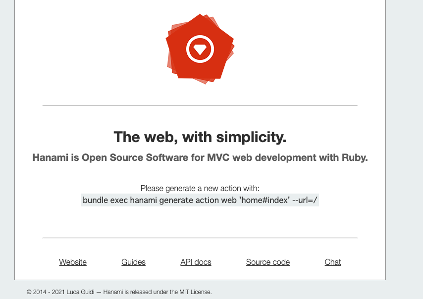

## Dockerfile を作成

以下を Dockerfile に記述します。

```dockerfile
FROM ruby:2.7.4-alpine

RUN apk add --no-cache build-base postgresql postgresql-dev libpq

WORKDIR /app
COPY Gemfile /app/Gemfile
COPY Gemfile.lock /app/Gemfile.lock
RUN gem install bundler -v 2.2.22
RUN bundle install -j$(nproc) --quiet
COPY . /app

EXPOSE 2300
```

Ruby のバージョンは 2.7.4 を選択。(3 系だと Hanami でエラーが出るので)
PostgreSQL を使えるようにしているだけの標準装備になっております。

<br>

## docker-compose.yml を作成

```yaml
version: '3.8'

services:
  web:
    build: .
    command: bundle exec hanami server --host=0.0.0.0
    ports:
      - 2300:2300
    volumes:
      - .:/app:cached
      - bundle:/usr/local/bundle
    depends_on:
      - db

  db:
    image: postgres:13.3-alpine
    volumes:
      - db_data:/var/lib/postgres/data
    ports:
      - 5432:5432
    environment:
      POSTGRES_USER: postgres
      POSTGRES_PASSWORD: password

volumes:
  db_data:
  bundle:
```

Ruby on Rails の Docker を使った環境構築と差はないように感じます。
なので、みなさまの使用したい環境に合わせてセットしていただけると嬉しいです。
(特にない場合は上記のもので十分だと思います。)
<br>
volumes には db と gem の永続化を行っています。

## Hanami プロジェクトの作成

`docker-compose.yml`を作成し終えたので、
続いて以下のコマンドを実行していきます。

### 各サービスの作成

```
$ docker compose build
```

### gem のインストール

```
$ docker compose run --rm web bundle install
```

### プロジェクトの作成

ドキュメントにある通り、Hanami には新規にプロジェクトを始める場合のコマンドが存在します。

```
$ docker compose run --rm web bundle exec hanami new . --database=postgres
```

今回は、postgresql を使用するのでオプションで使用するデータベースを選択しています。

## Hello, World！する

まだ、Hanami と PosgreSQL が接続できていないので、設定を変更します。

`.env.development`と`.env.test`
の以下の環境変数を変更する。
test の場合は以下のコードの development を test に変更してください。（または使用する db に変更してください。）

```
DATABASE_URL="postgresql://db:5432/app_development?user=postgres&password=password"
```

DB の作成を行います。

```
$ docker compose run --rm web bundle exec hanami db prepare
```

これで準備完了です。
コンテナを起動して`localhost:2300`にアクセスしましょう。

```
$ docker compose up
```

<br>
以下の画面が表示されたら完了です。お疲れ様でした。



## まとめ

この記事では、Hanami + Docker + PostgreSQL を用いて Hanami プロジェクトを作成し、Hello,World するところまでを説明しました。
<br>
Hanami は Ruby on Rails と違い DDD を意識したフレームワークになっており個人的にかなり学びたいフレームワークです。
これからも Hanami に関する記事を投稿できたらいいなと思います。
