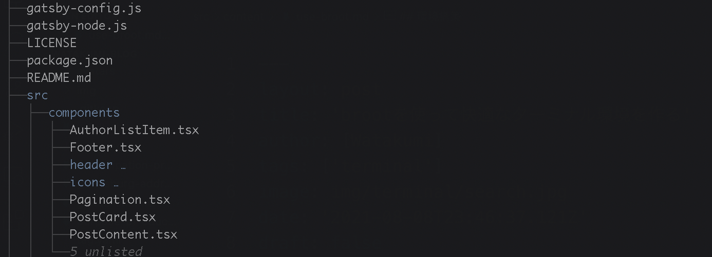

## broot とは

`tree`のように出力をし、ディレクトリやファイルの探索をしながら指定したアイテムに対して削除などのコマンドの実行などターミナルでできる操作を可能にするツールです。
探索しながら`cd`の実行やファイルの編集などができるようになり、使いこなせると快適な開発が行えるようになります。
最近使うようになりましたが、非常に役に立っているのでプッシュしていきたいです。



## 環境構築

1. `broot`をインストール

```
$ brew install broot
```

2. `broot` を実行

```
$ broot
```

実行できることを確認

## 使用方法

### 基本操作

broot ではユーザーの入力に対して検索を行い、ディレクトリ or ファイルの探索を行うことができます。
`broot`を実行して様々なワードを入力しましょう。
基本的に矢印キーと Enter キーで探索を行います。

### ディレクトリの移動を行う

broot コマンドでは`cd`のような shell の標準の機能を使うことができないため、
`br`コマンドを使用するよ良いです。`br`は`broot`に shell の標準の機能を使えるようにしたものです。

```
$ br
```

矢印キーと Enter キー、サーチ機能を使用して移動したいディレクトリを探索します。
`:cd`と入力すると画面下部に使用するコマンドが表示されるので確認後 Enter を入力します。
ex) `Hit enter to cd: cd /hoge/fuga`

### 開発したいプロジェクトを vscode で開く

1. vscode をターミナルから開けるようにする
   vscode 上で`⌘+shift+p`から`Shell Command: install 'code' command in PATH`を実行
   (shell と入力すれば候補に出ると思います。) <br>
   これでターミナルから`code`コマンドで vscode が開くようになりました。

2. `broot`コマンドを実行
3. `?`キーを入力しヘルプを開く
4. `:e`を実行し編集する
   ヘルプ画面で編集モードを実行すると config ファイルが開かれます。
5. verbs に以下を追加する

broot ではコマンドのことを`verb`と読んでいます。この`verb`で vscode が開くように設定を追加しましょう。

```hjson
 {
    invocation: vscode
    shortcut: code
    key: ctrl-v
    execution: "code {directory}"
 }
```

これで`broot` or `br`を実行時に指定したディレクトリ(または指定したファイルのディレクトリ)で`:code`を実行することで
ディレクトリで開発を始めることができます。

## まとめ

broot を使用した探索の行い方とディレクトリの移動。
応用として、vscode でディレクトリを開くショートカットの追加を紹介しました。
このほかにも色々なショートカットを使って素敵な broot ライフを送ってみてください。
自分も新たな発見がありましたら記事で紹介したいと思います！

## 参考

- [broot の Github](https://github.com/Canop/broot)
- [broot のドキュメント](https://dystroy.org/broot/)
