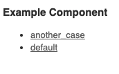
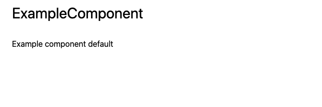

## View Component とは

- Ruby on Rails で使用できる gem です。
- Component を作成することで以下のメリットがもたらされます。
  - 再利用性
  - テスト容易性
  - view に関するロジックの集約
- コンポーネントとは、レンダリングされた view をいくつかの機能別、役割別のパーツの組み合わせとした時の１つを表すものです。

## 導入

```rb
gem 'view_component', require: 'view_component/engine'
```

※執筆時点での最新バージョンは`2.32.0`です。

## Component 作成のルール

- Compoentns は`ViewComponent::Base`のサブクラスであること
- `app/components`配下にあること
- Component の命名は`Component`で終わること(ex: `ExampleComponent`)
- Component のモジュール名は複数形とする(ex: `Examples::Component`)
- Component の命名は何をレンダリングするかで決めることで責務を分ける(ex: `UserComponent` -> `Users::AvatarComponent`)

## 健全なビューを作成するための機能

ここで定義する健全なビューとは、カプセル化されていてメンテがしやすく、何をするかが明確になっている状態を指します。

### プレビュー機能の導入

健全なビューを作成するために、`view_component`のプレビュー機能を利用します。

1. `lib/component_previews`ディレクトリを作成する
2. preview の path の設定を行う

```ruby
# config/application.rb
config.view_component.preview_paths << "#{Rails.root}/lib/component_previews"
```

以上の設定でプレビュー機能が利用可能になります。

### プレビュー機能を利用する

1.  Component を作成する

```
$ rails g component Example title --preview

Running via Spring preloader in process 49
      create  app/components/example_component.rb
      invoke  rspec
      create    spec/components/example_component_spec.rb
      invoke  preview
      create    lib/component_previews/example_component_preview.rb
      invoke  erb
      create    app/components/example_component.html.erb
```

```rb
# app/components/example_component.rb

class ExampleComponent < ViewComponent::Base
  def initialize(title:)
    @title = title
  end
end
```

```rb
# app/components/example_component.html.erb
# tailwindcssを使用しています

<div class='container mx-auto'>
  <h1 class='p-4 text-3xl'>ExampleComponent</h1>
  <div class='p-4'>
    <p><%= @title %></p>
  </div>
</div>
```

2. プレビューファイルを用意する

```rb
# lib/component_previews/example_component_preview.rb

class ExampleComponentPreview < ViewComponent::Preview
  # default case
  def default(title: 'Example component default')
    render(ExampleComponent.new(title: title))
  end

  # another case
  def another_case(title: 'Another Case')
    render(ExampleComponent.new(title: title))
  end
end
```

3. `rails/view_components/example_component`に遷移する


このような画面が表示されます。
プレビューを表示したい Case をクリックすると、`title`に指定した文字列が表示されていることが分かります。



以上でプレビュー機能を用いて複数のパターンを表示することができました。
次回は、プレビュー機能を使いながら実際の Rails での使い方について紹介したいと思います。
